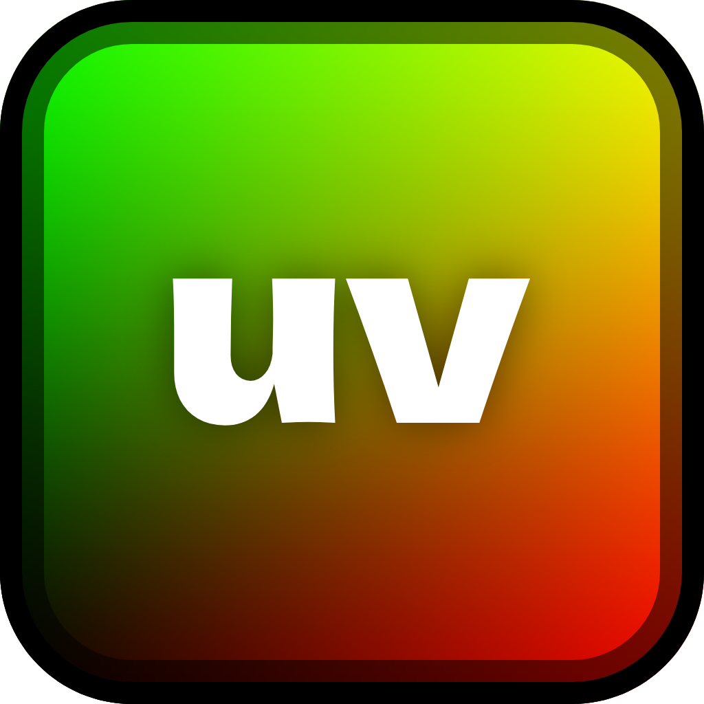

= uvBot
A free and open source TAS tool for Geometry Dash

WARNING: You are kinda early. This is still in heavy developemnt

== Quickstart
Go to https://github.com/thisisignitedoreo/uvbot/releases/latest[the latest release], download `aciddev.uvbot.geode`, and put it into `<Geometry Dash Installation>/geode/mods/`

== `.uv` format
The file format is as follows:

[,c]
--
typedef uint64_t frame_t;

struct input {
    frame_t frame;
    uint8_t flags;
    // Least significant bit - hold or release
    // The rest (.flags >> 1) - button:
    // 0 - Jump P1
    // 1 - Left P1
    // 2 - Right P1
    // 3 - Jump P2
    // 4 - Left P2
    // 5 - Right P2
};

struct physic {
    frame_t frame;
    float x, y, rotation, y_velocity;
};

struct replay {
    char front_magic[5] = "UVBOT";
    uint8_t version = 1;
    int32_t inputs, physics_p1, physics_p2;
    struct input input_actions[inputs];
    struct physic physic_p1_actions[inputs];
    struct physic physic_p2_actions[inputs];
    char back_magic[5] = "TOBVU";
};
--
